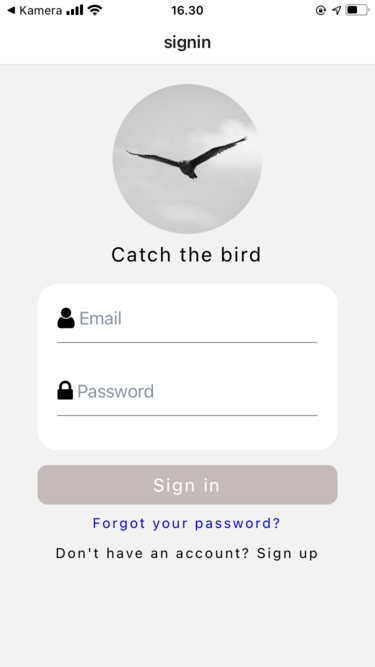
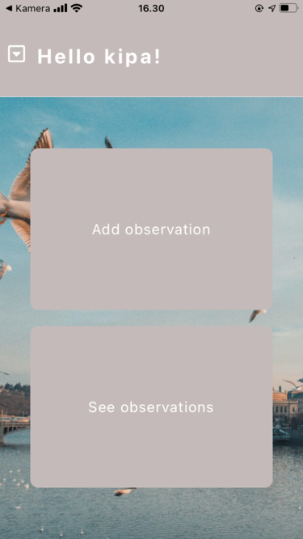
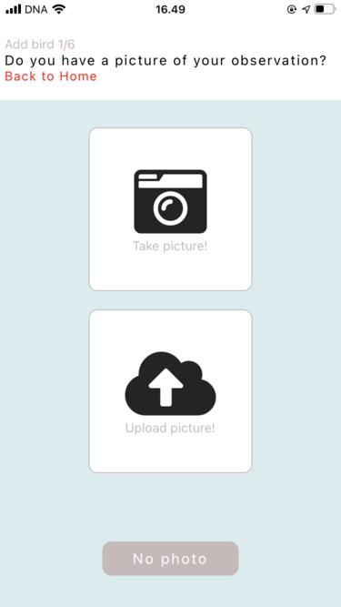
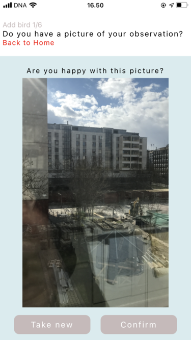
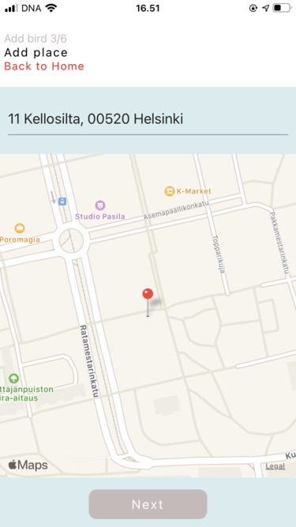
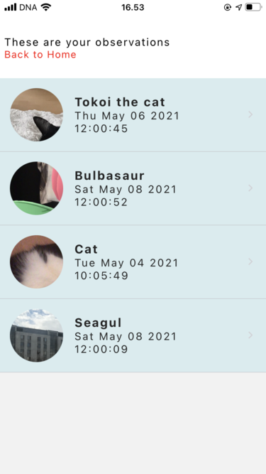
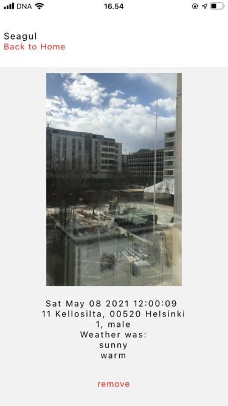

# Bird-observation-app
This is my final task for the mobile programming course taught by Markku Ruonavaara
in Haaga-Helia University of Applied Sciences, 2021.

User can add observations and see the list of all the saved observations. Observation can contain species, photo, place, time and weather.

## Build with
 - React Native
  - Firebase Realtime database to save the observations and userdata
  - Firebase Storage to save the pictures
  - Firebase Authentication

 ## Components
 - react-native-modal-datetime-picker
 - expo-camera
 - expo-location
 - react-native-elements
 - react-native-image-picker
 - react-native-maps
 - react-native-numeric-input
 - expo-image-picker

## Get started
To get the application running you need the following:
- [Node.js](https://nodejs.org/en/)
- [Expo](https://docs.expo.io/)
- [Expo CLI](https://expo.io/tools)/[Android studio](https://docs.expo.io/workflow/android-studio-emulator/) etc. Something to get the app running on your phone.

Clone the project: 

    $ git clone https://github.com/kri-ku/bird-obs-app.git

Navigate to the directory and run the following:

    $ npm install
    $ npm start

App will open in the browser and you can read the QR-code with your phone or start the app on your Android emulator.

## Issues

Known issues are listed on the [Github issues -page](https://github.com/kri-ku/bird-obs-app/issues).

## Examples

----

Pictures for the app are fetched from https://unsplash.com/.